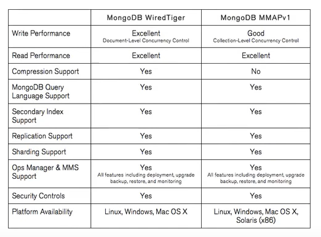

https://www.slideshare.net/NorbertoLeite/mongodb-wiredtiger-internals
https://www.youtube.com/watch?v=HIdTdarhYVA

**Path to Transactions - WiredTiger Timestamps:** 

**Understanding Journaling in MongoDB:**

**MongoDB : Storage Engine in MongoDB - Part 15:**

