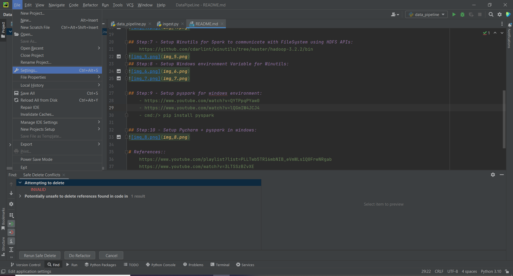
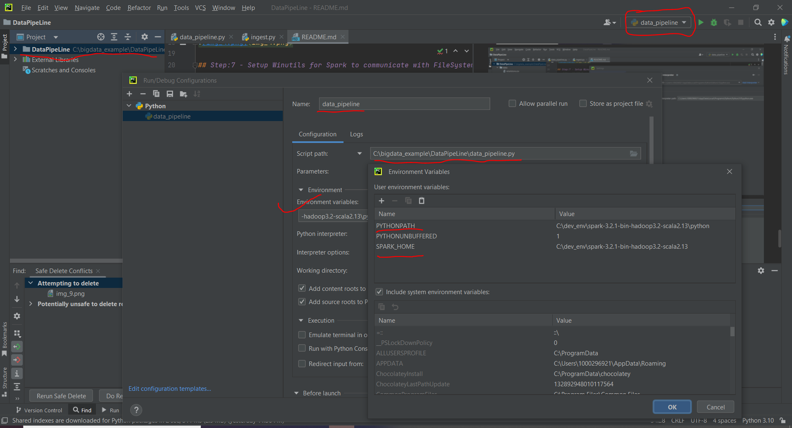

# PySpark code sample example:
    https://sparkbyexamples.com/pyspark/how-to-install-and-run-pyspark-on-windows/

# Pyspark run issue with windows Solutions:
    https://stackoverflow.com/questions/68705417/pycharm-error-java-io-ioexception-cannot-run-program-python3-createprocess

## Step:1 - Install Java 8 or 11:

## Step:2 - Download Python:
    https://www.python.org/downloads/
## Step:3 - Installation Python: (with Path entry)
## Step:4 - Verify Path entry in the (Edit Environment Variable)

## Step:5 - Download Spark and Setup:
    https://www.apache.org/dyn/closer.lua/spark/spark-3.3.0/spark-3.3.0-bin-hadoop3-scala2.13.tgz

## Step:6 - Setup Windows environment Variable for Spark:

## Step:7 - Setup Winutils for Spark to communicate with FileSystem using HDFS APIs:
    https://github.com/cdarlint/winutils/tree/master/hadoop-3.2.2/bin

## Step:8 - Setup Windows environment Variable for Winutils:

## Step:9 - Setup pyspark for windows environment:
    - https://www.youtube.com/watch?v=QYTPpqPYaw0
    - https://www.youtube.com/watch?v=lQGmIW4JCJ4
    - cmd:/> pip install pyspark

## Step:10 - Setup Pycharm + pyspark in windows:
    https://www.youtube.com/watch?v=3LTSSzBZvXE

Quick tips - winutils permission
If you face issues while creating a Spark session with Hive support on Windows machine, execute the following command as the 
administrator of your machine in the directory in which winutils.exe file is present - "winutils.exe chmod 777 /tmp/hive"
cmd:/>winutils.exe chmod 777 C:\dev_env\winutils-hadoop3.2.1\temp\hive

# CSV writing issue resolve using below link:
    https://sparkbyexamples.com/spark/spark-hadoop-exception-in-thread-main-java-lang-unsatisfiedlinkerror-org-apache-hadoop-io-nativeio-nativeiowindows-access0ljava-lang-stringiz/

# References::
    https://www.youtube.com/playlist?list=PLLTwb5TR16mbNIB_eVmWLs1Q0FrwNRgab
    https://www.youtube.com/watch?v=_C8kWso4ne4&t=457s
    https://www.youtube.com/watch?v=kKBXt1A_g18
    https://www.youtube.com/watch?v=OgS0noWVPJ4&list=PLLa_h7BriLH2UYJIO9oDoP3W-b6gQeA12&index=20
    https://www.youtube.com/watch?v=iSS_OjMat08&list=PL4gu8xQu0_5I_UtjmsGnjfhAEzcXoas1O&index=17
    https://www.youtube.com/watch?v=4oKOhOQd4xk&list=PL4gu8xQu0_5I_UtjmsGnjfhAEzcXoas1O&index=18

# Important::
    https://www.youtube.com/c/UnfoldDataScience/playlists
    https://www.youtube.com/watch?v=F4z_ex2mjro&list=PLmPJQXJiMoUVb-pXjo0MyZELiiykZyAo7&index=2
    