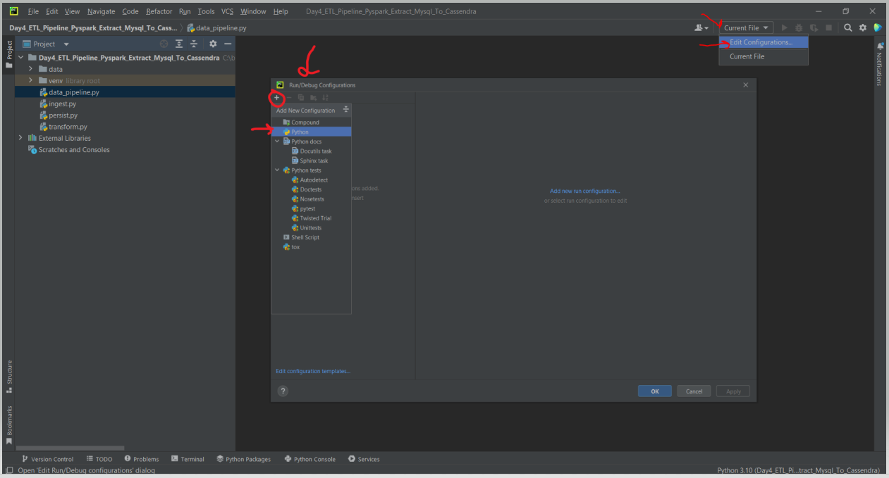

# Spark ETL Project Setup 
    Required Pieces of software: 
        1. Java 
        2. python 
        3. spark
        4. hadoop_winutils 
        5. pycharm

### Step:1 - Download & Install Java 8|11|17 + Windows Environment "JAVA_HOME"

### Step:2 - Download & Install Python 3.8 or later + Windows Environment "PYTHONPATH"

### Step:3 - Download and Setup Spark in Windows
#### Step:3.1 - Setup Spark 

#### Step:3.2 - Setup Hadoop Windows Utilities

### Step:4 - Download intellij pyCharm IDE Community Edition
#### Step:4.1 - Create Python Project for "pyspark"

#### Step:4.2 - Setup/Install "pyspark" for python Project

#### Step:4.3 - Edit runtime configuration for RUN "python + pyspark"

### Step:5 - Testing, Run & verify Script "data_pipline.py"
Run pyspark python code using spark-submit job:
- cmd:/> spark-submit --packages org.mongodb.spark:mongo-spark-connector:10.0.3 .\day1-python-spark-practices\mongo_db_testing_main.py
- cmd:/> spark-submit .\day1-python-spark-practices\main.py

# Installation & Setup Video References:

# Spark Learning:

# Other Video References:
https://www.youtube.com/c/UnfoldDataScience/playlists

# Other References:
- https://sparkbyexamples.com/spark/add-multiple-jars-to-spark-submit-classpath/

# Python Virtual Environment Creation and Restore using requirements.txt file
- https://www.akamai.com/blog/developers/how-building-virtual-python-environment