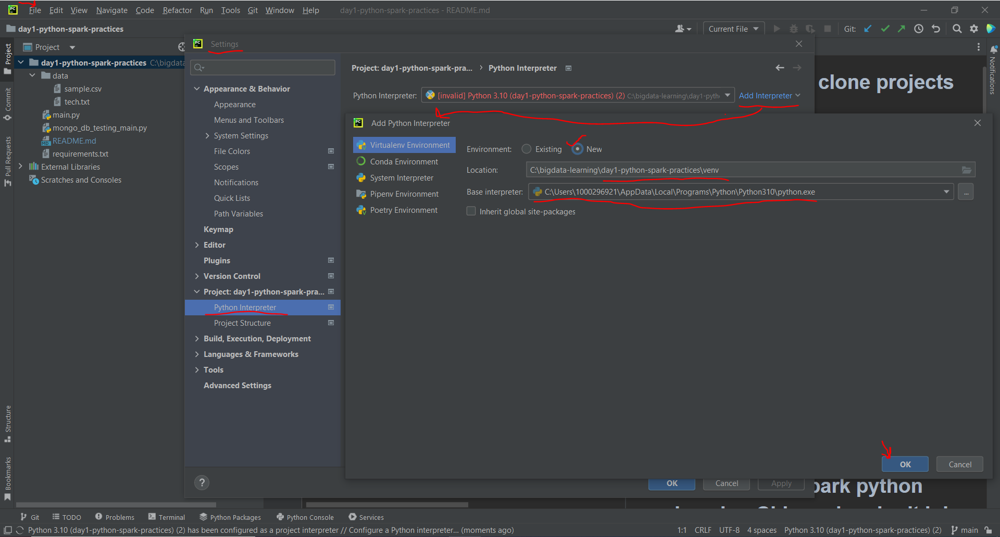
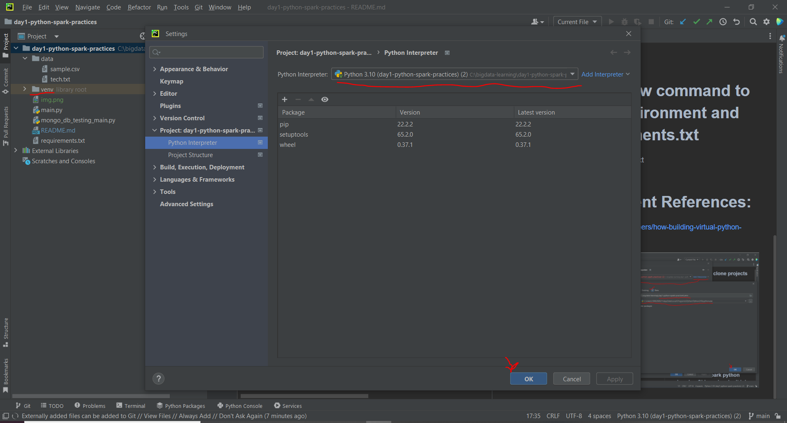
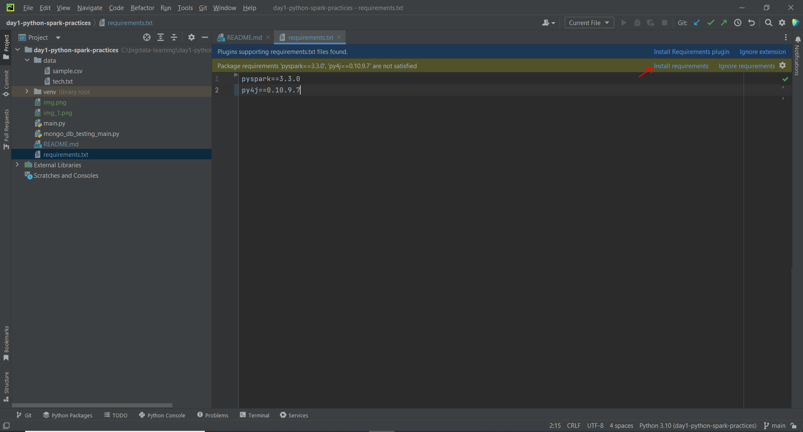
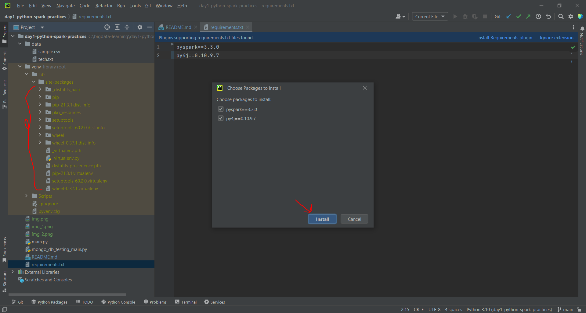
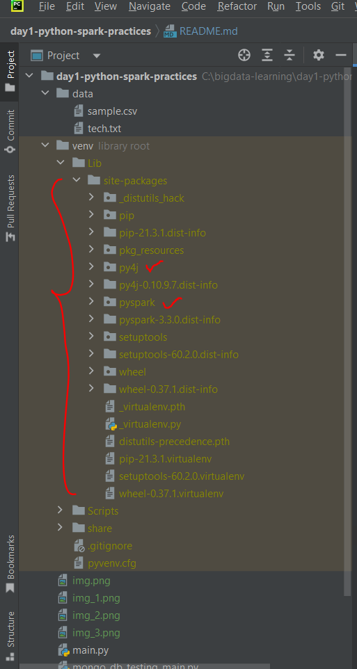

# Steps to setup git clone projects in intellij
    cmd:/> git clone https://github.com/rishant/bigdata-learning.git

# Step: 1 - Goto the project folder
    cmd:/> cd <project_floder>\bigdata-learning\day1-python-spark-practices

# Step: 2 - Use below command to create Virtual Environment
        cmd:/> pip install venv
        cmd:/> .\venv\Scripts\activate
(venv)  cmd:/> pip install -r requirements.txt

# Step: 3 - Run pyspark python code using CLI spark-submit job:
(venv)  cmd:/> spark-submit --packages org.mongodb.spark:mongo-spark-connector:10.0.3 mongo_db_testing_main.py
(venv)  cmd:/> spark-submit main.py

# Step: 4 - Use below command to freeze Virtual Environment and CREATE requirements.txt
(venv)  cmd:/> pip freeze > requirements.txt

# Virtual Environment References:
- https://www.akamai.com/blog/developers/how-building-virtual-python-environment

#### file -> settings -> Projects: <Project-folder> -> Project Interpreter -> "Create 'New' Virtual Environment"

#### open <Project-folder>/requirements.txt

#### install 'requirements.txt'

#### verify installed 'requirements.txt' dependencies
